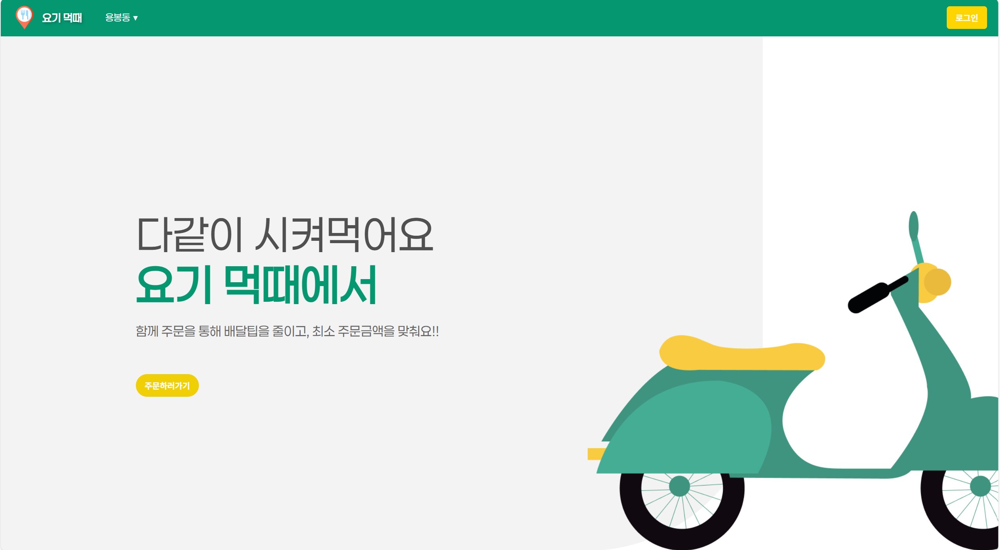
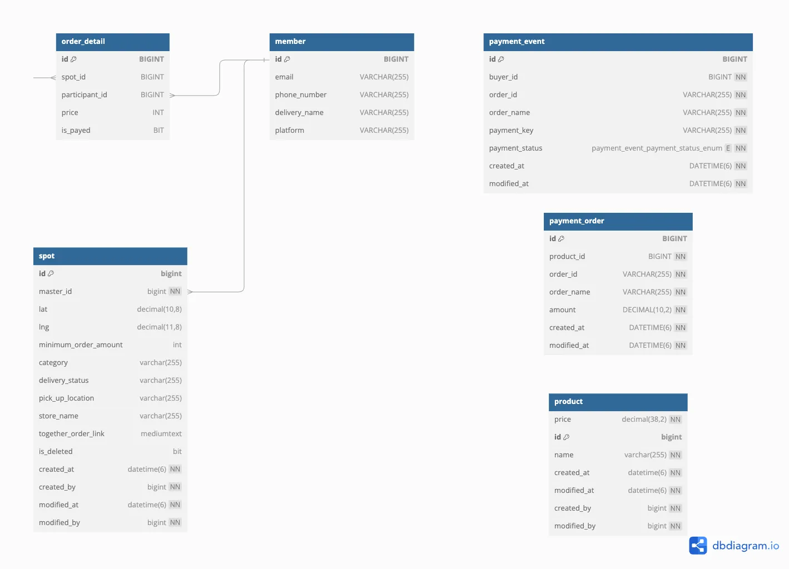

# Team14_FE

14조 프론트엔드

## 🍴요기먹때

- 🙋🏻‍♀️1인 가구 대상으로
- 👩‍👦함께 배달 음식을 주문할 수 있는 사람을 매칭해
- 💵배달 최소 주문 금액 부담을 덜고 추가적인 배달음식비 또는 배달팁을 줄이고자 함

## 배포 링크

✅FE: https://team14-fe.vercel.app/  
✅BE:

## 주요기능

- 카카오 소셜 로그인
- 배달 어플 함께 주문하기(카카오지도 API)  
  배달의 민족이 제공하는 "함께주문"을 통해 익명의 사용자와 함께 배달 주문을 할 수 있다.  
  지도 상에 표시된 마커와 리스트를 통해 배달 받을 장소와 가게를 확인하고 참여할 수 있다.
- 새로운 스팟 등록  
  자신이 원하는 음식을 방장이 되어 원하는 장소에 스팟을 생성할 수 있다.
- sms  
  선택한 스팟에 대한 "함께주문" 링크를 문자를 통해 받을 수 있다.
- 주문 결제(토스 페이먼츠 API)  
  이용자들은 구매한 포인트를 통해 해당 앱에서 배달 음식의 값을 지불할 수 있다.
- 주문 목록 확인  
  이용자들의 자신의 구매 내역을 확인할 수 있다.

## ERD 이미지

## 📆개발 기간

- 24.09.16 ~ 24.11.15

## 개발 인원 : 7명

| 이름   | 담당 역할 및 기능                                                      |
| ------ | ---------------------------------------------------------------------- |
| 강호정 |  마이페이지           |
| 서민지 |  스팟(메인)페이지     |
| 임지환 |  로그인 및 결제페이지 |
| 나제법 |  결제 API              |
| 서영우 |  로그인 API, 회원 API  |
| 안재영 |  SMS API, 결제내역 API |
| 유보민 |  지도(스팟) API        |

## ⚒️기술 스택

### ✅FE

  

### ✅BE

## 💻UI(이미지 추가)

소개 및 로그인 페이지

접은 내용

스팟페이지

접은 내용

마이페이지

접은 내용

